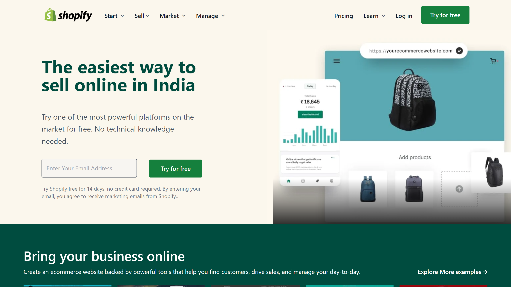
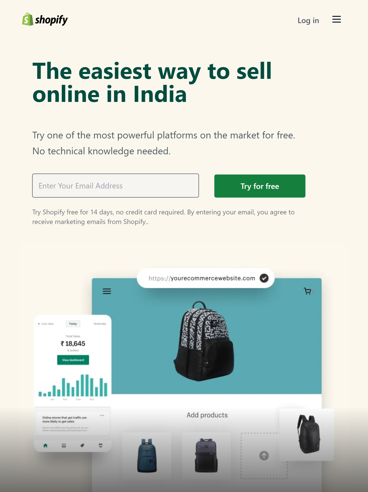

# Shopify Home Page  

This is Shopify home page clone made using html5 and tailwind css.

## Preview of different screen sizes

1. Desktop size
   

2. Tablet size
   

3. mobile size
   

## Author

- [Rakshit Koyani](https://raw.githubusercontent.com/rakshitkoyani/Dancer-portfolio/main/Project-14.png)

  
  
  

## Honest Time to finish the project

It took me around 9 hours to complete this project.

## Live link of the project

https://shopify-homepage-clone.netlify.app/
